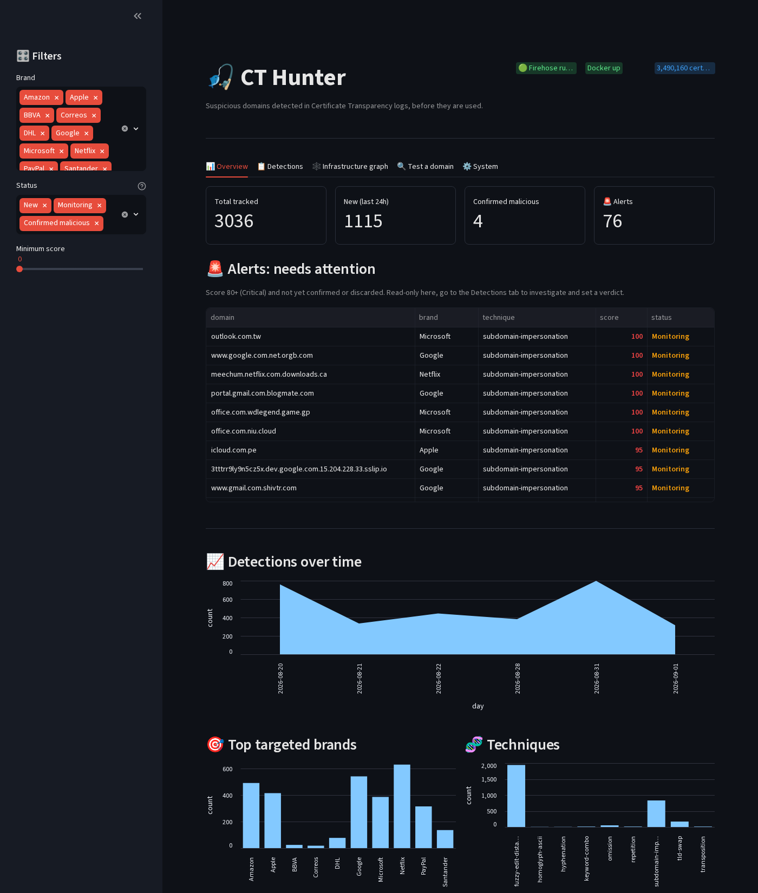
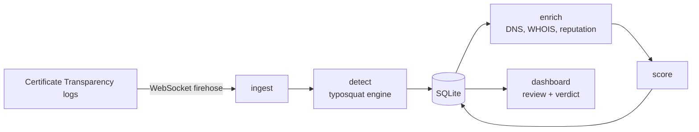
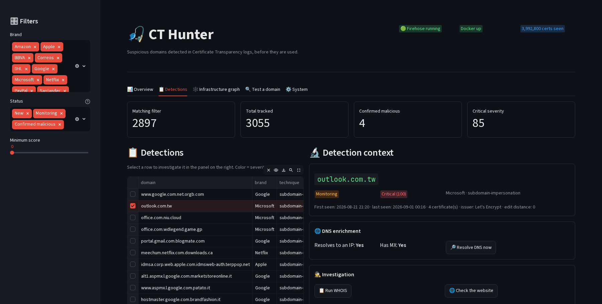
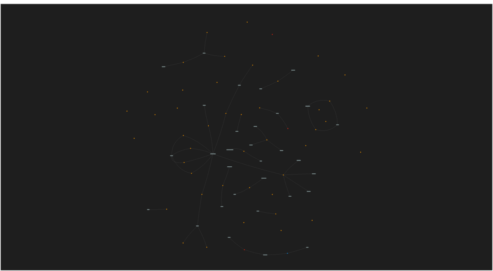

# ct-hunter


Watches Certificate Transparency logs in real time and flags
typosquatting domains as soon as a certificate is issued for them,
usually before there's even a page live on the domain.



## Why CT logs

Every phishing tool I'd used before this consumes a feed: OpenPhish,
PhishTank, VirusTotal, something that already did the work of finding
and confirming a bad domain. That's fine as a tool, but it's not
detection, someone else already did the interesting part.

Certificate Transparency logs are public, and since browsers require
a valid cert for HTTPS, most attackers request one almost immediately
after registering a lookalike domain. That request gets logged within
minutes. So instead of waiting to see a domain in a feed, you can watch
the log directly and catch it at the moment the certificate is issued,
sometimes days before there's any content on the site.

That's what this is: a self-hosted CT firehose, a typosquatting
detector, a corroboration step before anything gets called confirmed,
and a dashboard to actually go through what comes out the other end.
It's been pointed at live traffic since the start, and most of the
interesting problems came from that, not from the initial design: false
positives that only show up on real domains, a process that has to
survive running for days unattended, a database two processes hit at
once.



## A few things worth pointing out

The detection itself runs in layers because no single check scales to
real-time traffic. Most of the load is handled by a precomputed index
built at startup, every brand's likely variants (omissions, repeats,
transpositions, homoglyphs, TLD swaps, hyphenation, brand+keyword
combos) get generated once and looked up in O(1). Whatever that misses
falls through to a length-normalized Levenshtein ratio, which is too
slow to run against every domain by itself but fine as a fallback.
Subdomain impersonation (`brand.com.attacker.net`) gets its own check,
comparing on DNS label boundaries, since a plain substring match
flags things it shouldn't (`live.com` inside `xingkong-live.com`, for
instance).

Nothing gets auto-confirmed by the score. It can move a domain into a
watch queue on its own, but calling something malicious needs either
independent corroboration, a public feed match, VirusTotal above a
vote threshold, an explicit URLscan verdict, or a human actually
looking at it. A heuristic score is a guess, not evidence, and I didn't
want the tool quietly treating it like one.

Most of the actual bugs only turned up once this ran against live
traffic instead of a handful of test cases. Microsoft's CASB reverse
proxy pattern (`*.office.com.mcas.ms`) looked exactly like impersonation
until it showed up in real data. `apple.com.cn` tripped the subdomain
check because it happens to contain `apple.com` as a label prefix.
Short domains like `dhl.com` matched almost anything at edit distance
2, which needed a length-normalized ratio instead of a flat cutoff.
None of these are things you'd think to test for up front.

I also spent a fair amount of time on the parts that aren't the
"interesting" half of a detector but decide whether it actually runs
unattended: systemd instead of a background process that dies on
reboot, WAL-mode SQLite because two processes hit the same file
concurrently, a UI that shows a warning instead of crashing when a
subprocess call times out. That's usually the part that gets skipped.



## Quickstart

```bash
# 1. Start the CT log firehose (self-hosted)
docker run -d --name certstream --restart unless-stopped -p 8080:8080 \
  -v certstream-state:/data -e CERTSTREAM_CT_LOG_STATE_FILE=/data/state.json \
  ghcr.io/reloading01/certstream-server-rust:latest

# 2. Install dependencies
uv sync
uv run playwright install chromium   # for visual comparison (screenshot + phash)

# 3. Install the systemd user services (auto-restart on crash, start on boot)
# The unit files assume the repo lives at ~/Proyectos/CTI (WorkingDirectory=%h/Proyectos/CTI);
# edit that line in both files first if you cloned it somewhere else.
mkdir -p ~/.config/systemd/user
cp systemd/ct-hunter-hunt.service systemd/ct-hunter-dashboard.service ~/.config/systemd/user/
loginctl enable-linger "$USER"   # start at boot even without logging in
systemctl --user daemon-reload
systemctl --user enable --now ct-hunter-hunt.service ct-hunter-dashboard.service
```

The dashboard is now at http://localhost:8501, opening on the
**Overview** tab: KPIs, a few charts, and a read-only Alerts section for
anything Critical severity that has not been confirmed or discarded
yet. Investigating a specific domain and setting a verdict still
happens in the **Detections** tab.

From the **System** tab you can start/stop `ct-hunter-hunt` with a
button; that shells out to `systemctl --user` rather than spawning a
raw process, so it doesn't fight systemd's own crash-restart policy.

Without the systemd services, both can still be run by hand for a quick
test, they just will not survive a crash or a reboot:

```bash
uv run streamlit run src/ct_hunter/dashboard/app.py
uv run ct-hunter-hunt         # watches the live firehose, leave this running
uv run ct-hunter-enrich       # separately, resolves DNS and scores what's detected
uv run ct-hunter-reputation   # ASN + own infrastructure reuse + AbuseIPDB
uv run ct-hunter-crosscheck   # OpenPhish + URLscan (+ VirusTotal if an API key is set)
uv run ct-hunter-whois        # registrar + nameservers, feeds the infrastructure graph
uv run ct-hunter-triage       # moves 'New' to 'Monitoring' for exact-match techniques (backlog only, new detections get this automatically)
```

`ct-hunter-crosscheck` and `ct-hunter-reputation` use free external
sources. See [`.env.example`](.env.example) for the optional API keys
(VirusTotal, AbuseIPDB); none are required, copy it to `.env` and fill in
whichever you have.

The **Test a domain** tab runs any domain through the detector instantly,
without waiting for the firehose, useful for exploring the typosquatting
logic or running a demo.

Target brands (10, spanning tech, finance, logistics, and retail) are
configured in [`config/brands.yaml`](config/brands.yaml).

From a domain's panel you can also request a **visual comparison**
(screenshot from a real browser + perceptual hash against the brand's
legitimate site) and generate a **report draft** for a confirmed case.

The **Infrastructure graph** tab correlates domains that share an IP,
ASN, registrar, or nameserver, an interactive network view plus a list of
the resulting clusters. Known generic hosting/parking providers (Sedo,
AWS, etc.) are excluded from correlation, otherwise every domain on
shared hosting would look like it's connected to everything else.



## Case reports

[`reports/`](reports/) has a writeup for each domain that reached a
confirmed verdict: when the certificate was first seen, when it was
confirmed, both checkable against `data/ct_hunter.db`. That gap between
the two dates is the actual evidence that this catches things early,
rather than just restating something a feed already published. See
[`reports/README.md`](reports/README.md) for how a report gets put
together.

## Stack

Python 3.12, SQLite (no ORM, explicit SQL), Streamlit, dnspython,
rapidfuzz, tldextract, networkx + pyvis, Playwright + imagehash,
systemd user services. Dependency management via `uv`.

## Project status

v1: ingestion, detection, storage, scoring, visual comparison, and
external reputation (own ASN correlation, URLscan, optional
VirusTotal/AbuseIPDB) all working end to end.

v2: infrastructure correlation graph (IP/ASN/registrar/nameserver, not
just a flat ASN match), a reliability audit that found and fixed four
real production bugs (no process supervision across reboots/crashes, no
error handling in the ingestion path, a dashboard crash on stale filter
state, an on-demand task timeout crashing the whole session), SQLite
WAL mode plus log rotation for both processes, a performance pass
(cached dashboard status calls, vectorized table styling, three new
indexes, `synchronous=NORMAL`, parallelized DNS/reputation enrichment,
Playwright browser reuse for visual comparison, a precomputed brand
whitelist on the ingestion hot path), SQL-side pagination for the
Detections tab, an Overview tab (KPIs, charts, a read-only Alerts
section for anything Critical severity that has not reached a verdict
yet), and a reorganization of `src/ct_hunter` into subpackages grouped
by role (ingest, detect, enrich, storage, process, scripts) instead of
18 flat files.

Next: more CT sources watched in parallel, not just the one firehose.
